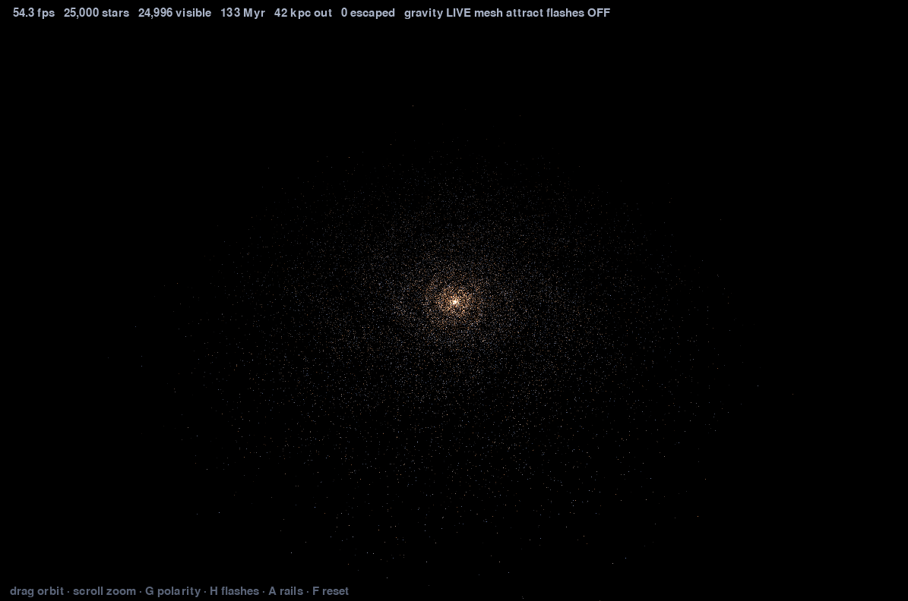

# galaxy_SIM

A self-gravitating spiral galaxy — 25,000 particles that actually pull on each
other, in 3D, at 60 fps in Python.

Gravity is solved on a particle mesh: the stars are smeared onto a grid,
Poisson's equation is solved in Fourier space where it becomes a division, and
the forces are interpolated back. That is how real galaxy simulations do it,
and it is the only reason 25,000 mutually-attracting bodies run in NumPy at
all — direct summation would be 312 million pair forces per frame.

<!-- Add a screenshot here. It is the first thing anyone looks at and there
     isn't one yet:    -->

## Run it

```bash
pip install -r requirements.txt
python main.py
```

Or build a double-clickable executable — no Python needed on the target
machine:

```powershell
.\build.cmd
```

That produces `dist\GalaxySim\GalaxySim.exe`. See [Building](#building) for the
two options in `GalaxySim.spec`.

**`pygame-ce`, not `pygame`.** Upstream pygame has no wheel for Python 3.14 and
its source build fails on the removal of `distutils`. pygame-ce is a drop-in —
`import pygame` is unchanged.

## Controls

| | |
| drag | orbit the camera |
| scroll | zoom |
| `G` | **reverse** stellar self-gravity — stars repel, halo and black hole still attract |
| `H` | collision flashes (decorative, default off) |
| `A` | live mesh vs. analytic rails, useful as a control |
| `SPACE` | pause |
| `R` | rebuild with a new seed |
| `F` | reset the view |

`G` is the interesting one. Flipping only the mesh term means stars push each
other apart while remaining bound to the halo, so the structure disperses and
then re-collapses when you flip it back. Reversing everything would just
detonate the galaxy in one frame.

## Layout

| file | holds |
|---|---|
| `config.py` | every constant, with its unit |
| `galaxy.py` | initial star field, and velocity rebalancing against the mesh |
| `gravity.py` | particle-mesh self-gravity — CIC, FFT Poisson, force interpolation |
| `physics.py` | halo, softened black hole, mesh polarity, optional spiral, leapfrog |
| `collisions.py` | same-cell proximity detection with guarded quantisation |
| `flashes.py` | sampled detection and a fixed pool of decorative flashes |
| `camera.py` | orbit camera, perspective projection |
| `render.py` | additive accumulation into a pixel buffer |
| `main.py` | window, input, loop |

## Stars attract each other

Direct summation is O(N²) — 312 million distinct pairs at this size. Barnes-Hut is
O(N log N) but spends its time building an octree, which is interpreted work
NumPy can't vectorise. So: **particle mesh**, which is what galaxy simulations
actually use.

Deposit the stars onto a grid, solve Poisson in Fourier space where it becomes
a division, interpolate the forces back. Cost is O(N) plus O(M log M), every
step is a single NumPy call, and it doesn't care how clustered the stars are.

The FFT is periodic, so the box is padded to twice the galaxy's width in each
axis — otherwise the galaxy is tidally torn by copies of itself.

**The halo stays analytic.** A disc of only visible matter can't hold a flat
rotation curve; that's the observation dark matter was invented to explain.
Live disc inside a rigid halo is standard practice in N-body work.

## Performance

Historical Linux-container measurements, warmed, 1200×800 (not the current Windows budget):

| grid | stars | cell | PM | render | total | |
|---|---|---|---|---|---|---|
| 24 | 40,000 | 46.7 px | 6.6 ms | 7.9 ms | 14.4 ms | 69 fps |
| **32** | **40,000** | **35.0 px** | **9.5 ms** | **7.5 ms** | **17.0 ms** | **59 fps** |
| 40 | 40,000 | 28.0 px | 13.3 ms | 7.7 ms | 21.0 ms | 48 fps |
| 40 | 25,000 | 28.0 px | 11.2 ms | 6.1 ms | 17.3 ms | 58 fps |

Grid size, not star count, is the binding constraint — the FFT runs on
(2·grid)³ cells regardless of how many stars there are.

**Those figures are from a Linux container and do not transfer** — they run
about 60% faster than the Windows machine this was built for. Frame rate is a
property of the hardware, so the only numbers worth acting on are your own:

```powershell
$env:SDL_VIDEODRIVER='dummy'; .\.venv\Scripts\python.exe -B bench.py
```

Measured on the target machine (Python 3.14, 300 frames after 60 warmup),
25,000 stars at `PM_GRID = 24`:

```
physics 7.34 ms + render 9.48 ms = 16.82 ms      59.4 fps
```

The path there, from 40,000 stars at grid 32, which ran **32.6 fps**:

| change | gain |
|---|---|
| `PM_GRID` 32 → 24 | ~30% of particle-mesh cost |
| `STAR_COUNT` 40k → 25k | ~20% of render cost |
| SciPy FFT backend | 1.8 ms |

**Install SciPy.** The backend falls back to NumPy silently without it and
`bench.py` prints which one is live. SciPy's transform is ~4x faster in
isolation but worth only ~2 ms overall, because the FFT was never the bulk of
the cost — of ~9.4 ms of particle mesh the split is weights 2.1, FFT 2.7,
interpolation ~3.4, deposition 0.45.

That historical 16.82 ms run was **0.15 ms over** the 16.67 ms budget.
Repeated runs straddle the limit; treat headroom as roughly zero. The current
five-seed comparison and default-off decision are recorded below.

The bounds guards account for ~2.5 ms and are not optional — without them one
escaped star silently corrupts the entire potential.

Two things that cost more than they looked:

**Four FFTs vs. two.** Taking the gradient in Fourier space needs an inverse
transform per axis. Solving for the potential once and finite-differencing it
on the grid costs two transforms and a few slices — 20 ms down to 8.

**`np.gradient` allocates three full grids per call**, about a third of the
budget. Central differences into a preallocated array instead.

## What it does not do

**No spiral structure emerges.** Measured: m=2/3/4 Fourier amplitudes sit
around 0.02 and *fall* over 195° of rotation. The disc is genuinely
self-gravitating and genuinely stable — it just isn't doing anything
interesting.

The reason is resolution. At grid 32 a cell is 35 px, larger than the
structures a spiral would be made of, so the mesh smooths away exactly the
scales that would go unstable. Getting emergent arms needs a finer grid and a
colder disc, and grid 48 is already under 40 fps.

So there are two honest routes, and they're a real choice rather than a
default:

- **Keep it live and accept a featureless disc**, or trade frame rate for grid
  resolution and see if arms appear around grid 48–64.
- **Set `SPIRAL_STRENGTH` back to `1.5e-10`** for an imposed density wave on
  top of live gravity. Arms that look right, but drawn rather than grown.

**Window drag freezes it.** Windows puts the process into a modal message loop
while you drag a title bar and SDL gets no cycles until you let go. Every
pygame application does this; it isn't fixable from inside the loop. What the
`dt` clamp does prevent is the lurch afterwards — without it the integrator
gets one enormous step and flings the disc apart.

**Also absent:** stars never age or change colour, there's no gas, no star
formation, no mergers, and particles are 2.4e6 solar masses each at the current 25,000 count — far too
heavy for real two-body encounters, which is part of why the mesh smooths them.

## Tuning

- `PM_GRID` — the frame-rate dial. 24 fast and coarse, 32 balanced, 40+ slow
- `STAR_COUNT` — cheaper than grid; 25k buys a grid step
- `USE_LIVE_GRAVITY` — `False` puts every star back on analytic rails, useful
  as a control when something looks wrong
- `SPIRAL_STRENGTH` — 0 for emergent-only, 1.5e-10 for imposed arms
- `CAM_*` — start distance, zoom limits, orbit sensitivity
- `EXPOSURE` — raise until arms read, lower when the core blows out


## Black hole, polarity, and decorative collision flashes

`COLLISIONS_ENABLED = False` is the default. Gate 4 measured **+1.552 ms/frame**
for detection, flash updates/spawning and rendering, exceeding the **0.5 ms**
acceptance threshold. This is why flashes are off by default. Press **H**, next
to **G** on the keyboard and in the key legend, to enable them; the HUD shows
ON/OFF. Disabling clears the pool and bypasses detection, updates and flash
rendering. Re-enabling starts fresh; rebuilding clears flashes but preserves
the enabled state. While paused, existing flashes fade in wall-clock time and
particles are not resampled.

Measured on this Windows machine at 25,000 particles, grid 24, 1200×800,
SciPy FFT with workers=-1 and the black hole enabled in both modes:

| RNG seed | Flashes off | Flashes on | Added cost |
|---|---:|---:|---:|
| 7 | 15.748 ms | 16.911 ms | +1.163 ms |
| 19 | 15.675 ms | 17.194 ms | +1.519 ms |
| 41 | 16.212 ms | 17.989 ms | +1.777 ms |
| 73 | 15.359 ms | 17.393 ms | +2.035 ms |
| 101 | 15.879 ms | 17.143 ms | +1.264 ms |
| Mean | **15.774 ms** | **17.326 ms** | **+1.552 ms** |

This is **63.4 → 57.7 fps**. Each run used 60 warmup frames and 300 measured
frames, with on/off order alternated. Timing covers physics through the render
blit; HUD, events, display flip and frame limiting are excluded. Five separate
900-frame runs with everything active and RuntimeWarnings treated as errors
stayed finite on every frame, with zero escaped particles. Timing varies on
this machine; one favourable run is not evidence of reliable headroom.

Detection runs every `COLLISION_INTERVAL = 4` active simulation frames. Gate 3
measured 0.470–0.524 ms/frame amortized, with 1.879–2.097 ms mean per detection
pass and a largest observed pass of 3.165 ms. Pool update cost was
0.0307–0.0334 ms/frame; spawning cost 0.0161–0.0178 ms per detection batch.
These component measurements are from separate runs and should not be summed
as a substitute for the full-frame comparison. The black-hole force alone
measured 0.393–0.397 ms/call; the sign switch applies only to the mesh term.

`COLLISION_RADIUS = 0.5 * MPP` means **15 pc**, both the proximity threshold
and hash cell width. Only same-cell pairs are tested; pairs across a cell
boundary are intentionally missed. This is a decorative sampling approximation,
not a complete collision census. Each detection batch spawns once. A fixed
`MAX_FLASHES = 256` pool overwrites the oldest slots; magenta flashes rise over
0.04 seconds and expire after `FLASH_LIFETIME = 0.6` wall-clock seconds,
independently of simulation speed. They share the stellar accumulation and blit.

**Flashes are decorative.** Real stellar collisions are vanishingly rare; at
this resolution each particle stands for 2.4 million solar masses. Two nearby
particles do not mean two stars touched. No mass, velocity or position is
changed by detection or flashes. **Reversed gravity is not physics**: G changes
only stellar self-gravity, leaving the halo and black hole attractive. A keeps
the analytic-rails control accessible; mesh polarity has no effect in that mode.

`BLACK_HOLE_MASS = 1e9 * SOLAR_MASS` is **250x Sagittarius A***, using a
4-million-solar-mass reference. It is chosen for **legibility**, not measurement,
with Plummer softening of 5 px (150 pc). Initial velocity rebalancing routes
through the same acceleration function and includes this force.

Gate 1's initially inner cohort (within 25 px) stayed near 17.6 px on frame one,
but contracted to roughly **13.5–14.0 px after 300 attractive frames** across
five seeds. This is not a settled inner equilibrium. The **mesh cell is 46.7 px**,
so the **inner ~15 px has no mesh resolution**: initial velocities include a
mesh field smoothed across a cell wider than that region. This accepted
resolution limitation is documented rather than tuned away.

Grid 24 and 25,000 particles remain the configuration. Grid-20 diagnostics
measured 16.449 and 16.276 ms with flashes, but widened the cell to **56 px**
against a **45 px** bulge already smoothed across a cell. That small frame-rate
gain was rejected as a poor resolution trade.

To reproduce timing using the configured default or an explicit override:

```powershell
$env:SDL_VIDEODRIVER='dummy'
.\.venv\Scripts\python.exe -B bench.py
.\.venv\Scripts\python.exe -B bench.py --collisions on --seed 7
.\.venv\Scripts\python.exe -B bench.py --collisions off --seed 7
```

## Building

`build.cmd` wraps `build.ps1`, because Windows blocks `.ps1` files by default.
The bypass it uses is scoped to that one process and does not change the
machine's execution policy.

Two switches at the top of `GalaxySim.spec`:

**`ONEFILE`** — `False` gives `dist/GalaxySim/GalaxySim.exe`, a folder you click
into, which starts immediately. `True` gives a single file that unpacks ~200 MB
of NumPy and SciPy to a temp directory on *every* launch, so there are several
seconds of nothing before the window appears. The folder is the better click
unless you need to move one file around.

**`BUNDLE_SCIPY`** — `False` produces a much smaller build that still runs;
`gravity.py` falls back to NumPy's FFT, at a cost of about 4 fps.

The build is windowed, so a crash closes it silently. `main._run()` catches that
and writes `galaxy-sim-crash-<timestamp>.log` beside the executable. If a build
fails to start at all and leaves no log, the failure is before Python runs — set
`console=True` in the spec, rebuild, and run it from a terminal.

## Licence

MIT. See [LICENSE](LICENSE).
